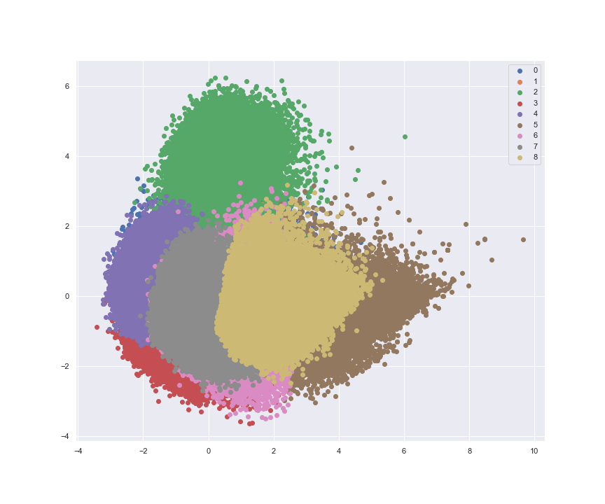

# Content-Based Recommendation of Songs from Spotify

 
    
     
    <em>Source: Photo by <a href="https://unsplash.com/@alexbemore?utm_source=unsplash&utm_medium=referral&utm_content=creditCopyText">Alexander Shatov</a> on <a href="https://unsplash.com/?utm_source=unsplash&utm_medium=referral&utm_content=creditCopyText">Unsplash</a>
  </em>
 

 ## Project Summary 

In this project I am implementing a content-based recommendation system using a K-Means clustering algorithm to predict songs (pieces) from Spotify based on a playlist from a user.

The resulting K-Means cluster looks like this: 

 
    

These clusters are then used for the content-based recommendation.  

## How can you use it?

### Technical Requirements

* Python 3.8
* Pandas
* scikit-learn
* matplotlib
* seaborn
* scipy

### Files

The important files are: 
* **music_recommender.ipynb**: analysis of data from Spotify and building a content-based recommender for tracks
* **blog_post.md**: _Demystifying Recommendations By Predicting Your Next Favorite Songs (Or Pieces)_ - an evaluation of the data from Spotify and Introduction to the Music Recommender
* **data**: the data I used can be found under data/ 

## Credits and Acknowledgments

Must give credit to Yamac Eren Ay who created the dataset as part of a Kaggle competition and inspired my work. You can find the data and competition [here](https://www.kaggle.com/yamaerenay/spotify-dataset-19212020-160k-tracks). Additionally, I would like to thank Spotify for providing a Web API and access to the features associated with the tracks.
Feel free to use the code here as you would like!
