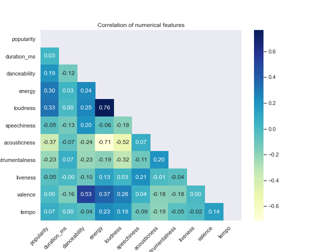

# Demystifying Recommendations By Predicting Your Next Favorite Songs (Or Pieces)

 
    
     
    <em>Source: Photo by <a href="https://unsplash.com/@alexbemore?utm_source=unsplash&utm_medium=referral&utm_content=creditCopyText">Alexander Shatov</a> on <a href="https://unsplash.com/?utm_source=unsplash&utm_medium=referral&utm_content=creditCopyText">Unsplash</a>
  </em>
 

Have you ever wondered how all these platforms like Spotify, Amazon or Facebook create the recommendations for songs, books, movies, electronic devices or contacts?  
Sometimes, the suggestions fit very well and sometimes they don't fit at all ("_I just bought a power bank, why would I need a second one a day later?!_").  And while for some decisions it seems to be quite clear how they were made, for others it is less obvious. These are the recommendations that surprise us and might even be a real added value to us. But at the same time, you might get a bit suspicious because you just don't know how the algorithms work and potentially influence your behavior.  

Of course, I don't know how exactly the recommendation engines of all these companies work. But there are some commonly used methods that I will quickly introduce and I will show you one of them for the recommendation of songs on Spotify. 

## Common Recommendation Methods

There are three main branches of recommenders:
* knowledge-based recommendations
* collaborative filtering-based recommendations
* content-based recommendations

### Knowledge-Based Recommendations

This type of recommendations is based on knowledge that the user gives to you via specific queries. An example would be a shopping website for clothes where you as a user might filter the articles for size, color and prize. 

### Collaborative Filtering-Based Recommendations
Instead of using user queries, you can recommend items based on the behavior and preferences from other users (collaborating).
Let's say we would like to recommend movies to a user. Then you search for users that show similar taste as the user to predict what the user might like to watch next.

### Content-Based Recommendations
Another common method is not to compare users but instead content for recommendations. The algorithm recommends items that are similar to the ones that a user liked or has watched / read etc. These recommendation systems are particularly useful when we do not have a lot of user-item connections available in our dataset, i.e. we have some information about the data but not about the other users.    

In reality, you will often find a combination of these engines if you have the necessary information.
With my project, I will show you an example of how content-based recommendation can be used for songs on Spotify.

## The Project: Content-Based Recommendation for Songs

### About the Dataset

As dataset, I used the dataset from the Kaggle Competition [1]. The data contain more than 500 k tracks and a bit over 1 million artists. 
The basic features are audio features provided from Spotify through its Web API [2]. The datasets include additional information like genres, popularity and followers.

### Data Exploration

To give you an overview and a better understanding of the data, I'll show you some results from my data exploration.
Generally, there are two datasets, one with information about tracks and one with information about artists. Since I'd like to recommend tracks, I'm more interested in the tracks dataset, but the other data contains information about genres which might be interesting.

#### Artists
First, let's take a look at the most frequent artists in the tracks dataset:

 
    

From a music history perspective, it makes sense that classical musicians are in the list of top artists because their pieces have been existing for several hundreds of years. I'm surprised to see so many German books and otherwise completely unknown artists which might be due to the way the data was created. 

#### Release Date of Tracks

 
    

We see here the frequency of tracks over the years until now. Given that the digital format of music is not so old, it is interesting to see how many tracks even from the first half of the 20th century have been transformed.

#### Keys

 
    

**Explanation:** The numbers represent the keys the piece / song is in, starting from 0 = C, 1 = C#/D Flat etc.  
As every (hobby) musician knows, C (0), D (2), G (7) and A (9) are very popular choices for keys because they don't have so many sharps / flats. This is well represented in our dataset.

#### Modes

 
    

**Explanation**: Mode 0 = Minor, Mode 1 = Major  
As you can see, two thirds of the tracks are in a major key (commonly associated with "happy") while one third is in a minor key (commonly associated with "sad"). 

#### Time Signature

 
    

There are two things to note about the time signature. First, the majority of the tracks is in a 4 time signature which is known to be a popular choice in pop music (I don't have any statistical proof here but if you don't believe me just go and listen to the radio for a while... ;-)  
Second, there is a time signature 0. This makes sense for pieces that e.g. only consist of rain or other noise but also indicate false classification which cannot easily be fixed (class 0 applies for 310 tracks).  
With this knowledge I wouldn't recommend using it this as feature for a model: It probably doesn't have added value and is potentially not reliable.

#### Acoustic Features

 
    

 
    

To explore the audio features, let's have a look at the boxplots which show the distribution of the data in terms of quantiles. 
Interestingly, "acousticness" has the largest range between the bottom (1st quantile) and the top edge (3rd quantile) of the box. This could be useful when learning a model. In contrast, the boxes of "speechiness" and "instrumentalness" have a very narrow range with a small variance and a higher number of outliers. They might not be so important as features of the model.  

 
    

Looking now at the correlations, we especially see:
* high positive correlations: energy - loudness, valence - danceability
* high negative correlations: acousticness - energy, acousticness - loudness

The correlations imply some linear relations between some audio features which is often times not so useful for models, so I will remove "energy" from my features for the model. 

### Content-Based Recommendation

Now that we have an overview of the data, we can build a model.  
You might have seen in the previous section that there is no direct information about users. We can still build a recommender system based on content and then test it with user data. 

#### The Recommender System

Generally for a recommendation engine, you have (a) user item(s) and based on that you try to find similar user items. There are multiple  similarity metrics that you can use. There have been works that incorporate clustering algorithms into the recommendation process [3, 4, 5]. So I decided to use a clustering model (K-Means) which is trained on the data to measure the similarity between tracks. Based on the cluster classes of the tracks from the user, the similar items are computed. I'll go more into detail about that below. 

#### Clustering Algorithm and Features

For the clustering, I use K-Means which groups similar items into k clusters. In that process, it calculates the euclidean distance between points as measure of similarity and clusters the points to their most similar centroids. Why is that important? Because this is a problem for non-numerical features. Categorical / binary features come from a discrete, non-continuous sample space so that the euclidean distance doesn't have a meaning. There are variations of K-Means (like k-Prototypes) that can handle continuous and categorical data and distance metrics like the Gower distance for categorical data but both alternatives are memory-intensive and costly. So I decided to only use numerical data as features. 

 
    
     
    <em>Example data with features used for model
  </em>

#### Optimizing K-Means

A really important hyperparameter for K-Means is the choice of k, the number of clusters. A commonly used method to find the optimal k is the elbow method. For that, the algorithm is trained with different numbers of k and the result is plotted. The k to choose is where the graph decreases abruptly. In our case, the optimal k is 9.

 
    

Now let's build the clustering model with k=9 and fit the dataset to it. To visualize it, I'm reducing the dimensionalities with PCA and two components so that the data can be plotted.  
This is the result: 

 
    

The clusters seem to be quite close together but it's visible that there are different clusters.

#### User Input

The next step is to get some user input and create a certain number of recommendations based on the provided songs. 
Theoretically, the songs don't have to be in the tracks dataset. However, then you don't just need the name of song and artist but also the respective audio features. An idea for future work could be to build an API which has access to the Spotify Web API where these features are available. For now, I will use a list of songs from the dataset with 10 songs / pieces.

 
    
     
    <em>User List with mix of pop and classical music</em>

#### Make Recommendations

How do we get from the user list to a list of recommendations for the user?  One way would be to predict similar songs for each of the user items. Instead, we will use our clustering model, predict the classes of the user items and select tracks that are similar to the user items from the most frequent classes.  

First, we predict to which classes the user inputs belong. Then, use the top n of these classes (= the most frequent classes). Based on the frequency of the classes, determine how many recommendations will be made with the user items of that class. Finally, choose the most similar items based on the mean user item from these classes as recommendations.  

Too complicated?  

Let me show you with our example.  
Assume `top_n = 3`, `number_of_recommendations = 5`.
1. Prediction: `[8 5 5 7 5 4 3 7 4 7]` 
2. top_n classes: `[5 7 4]`
3. class 5: 2 recommendations, class 7: 2 recommendations, class 4: 1 recommendation
4. Calculate a mean vector from all user items from the respective class
5. For this mean vector, choose the most similar tracks from the whole tracks dataset

 
    
     
    <em>Resulting recommended tracks</em>

Now it's up to me to listen to the tracks and find out whether I like them or not. ;-) 

### Conclusions

While my project is a fairly easy example for a recommendation system because it only uses one type of the common methods, I hope I could demystify for you a bit how recommendations are made.  

**My key takeaways for you are:**  
* Recommendation systems are not that complicated 
* The quality of the recommendations depends on the similarity metric you choose

If I were to give you a task, it would be to go on your favorite websites, think about which recommendation system(s) they are using and how you could influence the recommendations made for you.  
In the meantime, my task is to improve the clustering model, potentially include the categorical features, investigate the popularity ratings and maybe building an API to allow user input to test the recommendation system.  

Now the only question left is: Which website do you have in mind right now?

 
---

[1] Kaggle Competition Data. https://www.kaggle.com/yamaerenay/spotify-dataset-19212020-160k-tracks (retrieved: 07/20/2021)  
[2] Spotify Web API. https://developer.spotify.com/documentation/web-api/ (retrieved: 07/20/2021)  
[3] J. Das, P. Mukherjee, S. Majumder and P. Gupta, "Clustering-based recommender system using principles of voting theory," 2014 International Conference on Contemporary Computing and Informatics (IC3I), 2014, pp. 230-235, doi: 10.1109/IC3I.2014.7019655.  
[4] Ezenkwu, Chinedu & Ozuomba, Simeon & Kalu, Constance. (2015). Application of K-Means Algorithm for Efficient Customer Segmentation: A Strategy for Targeted Customer Services. International Journal of Advanced Research in Artificial Intelligence(IJARAI). 4. 10.14569/IJARAI.2015.041007.   
[5] S. Pandya, J. Shah, N. Joshi, H. Ghayvat, S. C. Mukhopadhyay and M. H. Yap, "A novel hybrid based recommendation system based on clustering and association mining," 2016 10th International Conference on Sensing Technology (ICST), 2016, pp. 1-6, doi: 10.1109/ICSensT.2016.7796287.
